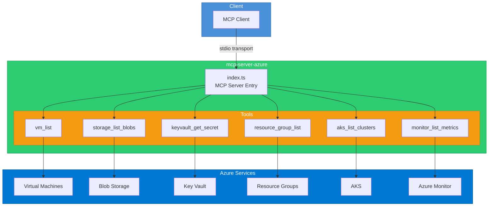

# mcp-server-azure

An MCP (Model Context Protocol) server that provides tools for interacting with Azure services including Virtual Machines, Storage, Key Vault, Resource Groups, AKS, and Monitor.

## Architecture



## Installation

```bash
npm install
npm run build
```

## Configuration

Set the following environment variables or use Azure CLI authentication:

| Variable | Description | Required |
|---|---|---|
| `AZURE_TENANT_ID` | Azure AD tenant ID | Yes (if not using CLI auth) |
| `AZURE_CLIENT_ID` | Azure AD application client ID | Yes (if not using CLI auth) |
| `AZURE_CLIENT_SECRET` | Azure AD application client secret | Yes (if not using CLI auth) |
| `AZURE_SUBSCRIPTION_ID` | Azure subscription ID | Yes |

## Usage

### Standalone

```bash
npm start
```

### Development

```bash
npm run dev
```

### Docker

```bash
docker build -t mcp-server-azure .
docker run -e AZURE_SUBSCRIPTION_ID=xxx -e AZURE_TENANT_ID=xxx mcp-server-azure
```

### MCP Client Configuration

```json
{
  "mcpServers": {
    "azure": {
      "command": "node",
      "args": ["dist/index.js"],
      "env": {
        "AZURE_SUBSCRIPTION_ID": "your-subscription-id"
      }
    }
  }
}
```

## Tool Reference

| Tool | Description | Parameters |
|---|---|---|
| `vm_list` | List virtual machines | `resource_group?` |
| `storage_list_blobs` | List blobs in a container | `account_name`, `container_name`, `prefix?` |
| `keyvault_get_secret` | Get a Key Vault secret | `vault_name`, `secret_name` |
| `resource_group_list` | List resource groups | none |
| `aks_list_clusters` | List AKS clusters | `resource_group?` |
| `monitor_list_metrics` | List metrics for a resource | `resource_uri`, `metric_names`, `timespan?`, `interval?` |

## License

MIT
